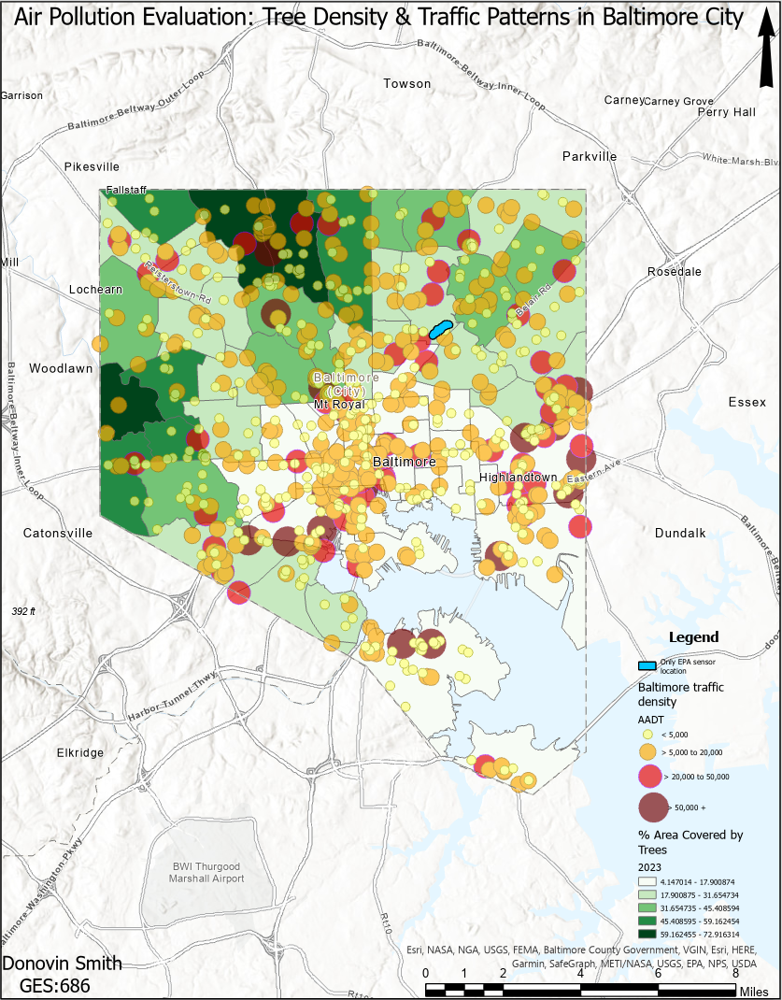
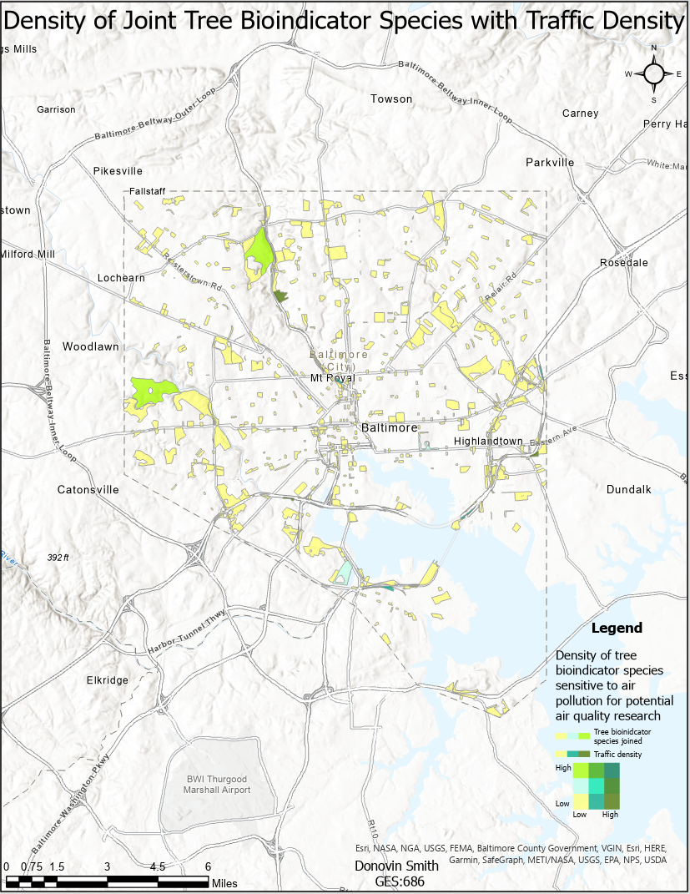
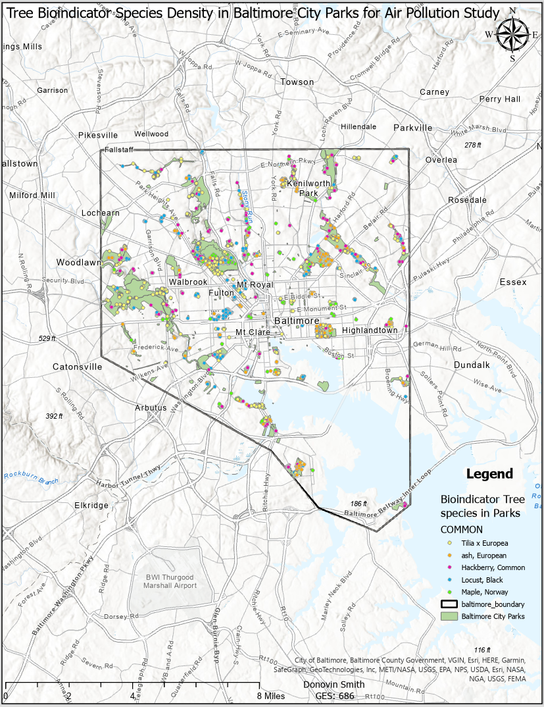

Background information: Air quality is still a concern for Baltimore residents. There isn’t an air quality sensor network or any data in Baltimore to collect and compare. There aren't any resources or current grants for quality EPA grade air sensors. Lake Montebello is the only air quality sensor location.
1.	Growing network of crowd source networking (e.g., Purple Air sensors and the growing network there) - but not necessarily equally distributed throughout urban centers in order to capture variability in air pollution and air quality.
2.	Interested in seeing if trees as bioindicators are a potential monitoring option for diversifying and distributing the air pollution monitoring network in urban areas.

### Tree and Traffic Pattern Analysis 
{height = "50%"}

This is important because the only EPA grade air sensor is located in Lake Montebello. This particular area is not the best location to install an air quality sensor. There are areas in Baltimore city with denser traffic and less percent area coverage of trees. The community that surrounds lake Montebello is a middle-class community. With all the environmental justice issues that encompasses air equality and air pollution, there are other sections of Baltimore city such as West and South Baltimore that need an EPA air sensor more than lake Montebello. Not to mention, the trash incinerator and CSX Transportation coal plant in South Baltimore. These locations have minimal tree density and would be good locations to request a grant for a new street tree initiative program. Street trees can lower urban air temperature, reduce harmful pollutants, and improve public health extreme weather events. 

### Tree Bioindicator Species & Traffic Density
{height = "50%"}

For my thesis project my focus will be using or potentially using trees as bioindicators for air quality. Biological indicators or bioindicators are living organisms (microbes, animals and plants) that are used as a potential tool to monitor the changes (either positive or negative) in environmental health and their possible impact on human civilization (Azzazy, 2020). Baltimore air pollution levels result from Ozone (O3) and fine particulates (PM 2. 5). These pollutants are Maryland's biggest air barriers when looking at air quality. Both pollutants are created from fuel-burning sources such as vehicles, electric utilities and industrial boilers. This map analyzes traffic density in Baltimore city and joins tree bioindicator species. Tilia Europaea. Ash Europea, Hackberry common, Locust Black, Maple Norway are tree species in Baltimore city that are most sensitive to air quality that have the best potential to monitor air quality.This is important because it’s only one air sensor located in Baltimore city. Developing an alternative air monitoring network system would help gather results from research to show policy makers that Baltimore officials have to do more to establish healthier air qualities around the city. Even though this issue isn’t a priority to the EPA, Baltimore state and local officials have the power to improve air quality by developing alternative sustainable methods for air quality improvement. 

### Tree Bioindicator Species in Baltimore City Parks
{height = "50%"}

Analyzing tree bioindicator species with parks and the size of the park to analyze tree ability to absorb pollution in park space. Smithsonian is the lead organization on a new satellite that just launched this year that is looking at ozone. There is remote sensing data collected, and they’ve also been working with groups to grow ozone gardens (with plants that are sensitive to changes in ozone levels) that can help ground truthful results for remote sensing. These parks need to be evaluated for new projects such as planting O-zone gardens to establish a connection with the community to build an urban network of citizen scientists. For example, the outer boundary that separates Druid hill Park from Falls Jones expressway would be a candidate location for an ozone garden because of its close proximity to congested highway traffic. Ozone gardens are planted with special bioindicator species that show visible signs of ozone damage on their leaves, like yellowing or black spots. Other sensitive plant species may be affected by high ozone levels, but we aren't able to see ozone injury on their leaves. Planting Ozone gardens would be a good way to compare air quality data with tree bioindicator species. For example, this would allow researchers to understand pollution trends from I-895 and I-95 traffic to see which species accumulate higher quantities of heavy metals and other PM 2.5 sized pollutants to compare with air sensor data. For my graduate project I may potentially work with the Smithsonian Research Center’s (SERC) Ecology department to develop and test some low-cost air quality sensors.  While also learning how to calibrate using higher end sensors that can provide real-time data at the community level for disadvantaged communities in Baltimore. There are some personal monitors, but the layout of those is haphazard and they aren’t regularly calibrated to anything that makes the data really reliable. So, I think working together with SERC would be a great idea, we’re trying to come up with some tools to split the difference. They will be more complicated than the purple monitors (although still low cost and ability to be produced in a DIY style with off the shelf parts and a 3D printer) with the ability to add specific sensors of interest (so if folks wanted to look at VOCs or lead, PM 2.5,10) and that we could calibrate and network together so that all of the data went to one place and is easily available to communities. Baltimore City parks would be a great location to compare and contrast air pollution data with o-zone gardens and tree bioindicators species.

